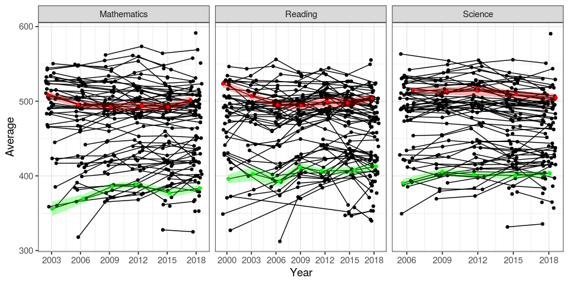

PISA
====

The dataset was obtained from the PISA International Data Explorer
(<a href="http://pisadataexplorer.oecd.org" class="uri">http://pisadataexplorer.oecd.org</a>).
I edit the data in a way it would be easier to load it in R, both files
the original one downloaded from the PISA website and the edited one are
available at
<a href="https://github.com/lsbastos/PISA/" class="uri">https://github.com/lsbastos/PISA/</a>

PISA evolution (?) through time
-------------------------------

There is no country (or region with a clear improve), I decided to
emphasize Brazil and UK.

``` r
pisa <- readxl::read_xls("../Data/PISA2000-2018.xls") 

pisa %>% filter( !is.na(Average) ) %>% mutate(Year.j = jitter(as.numeric(Year))) %>%  ggplot(aes(x = Year.j, y = Average, group = Jurisdiction )) + 
  geom_point() + 
  geom_line() + 
  geom_point(data = . %>% filter(Jurisdiction == "Brazil"), 
             mapping = aes(x = Year.j, y = Average), col = "green") + 
  geom_ribbon(data = . %>% filter(Jurisdiction == "Brazil"), 
             mapping = aes(x = Year.j, 
                           ymin = Average - 2 * `Standard Error`,
                           ymax = Average + 2 * `Standard Error`), 
             alpha = 0.3,
             fill = "green") + 
  geom_point(data = . %>% filter(Jurisdiction == "United Kingdom"), 
             mapping = aes(x = Year.j, y = Average), col = "red") + 
  geom_ribbon(data = . %>% filter(Jurisdiction == "United Kingdom"), 
             mapping = aes(x = Year.j, 
                           ymin = Average - 2 * `Standard Error`,
                           ymax = Average + 2 * `Standard Error`), 
             alpha = 0.3,
             fill = "red") + 
    theme_bw(base_size = 14) +
  scale_x_continuous(name = "Year", breaks = c(2000, 2003, 2006, 2009, 2012, 2015, 2018)) + 
  facet_wrap(~Subject, scales = "free_x")
```



PISA averages per country by subject and year
=============================================

``` r
tbl.sub.year <- pisa %>% filter(Year > 2014) %>%  group_by(Subject, Year) %>% summarise(n = n())

index.list <- 1:nrow(tbl.sub.year)

pw.list <- lapply(index.list, 
                 function(x){
                   data.aux <- pisa %>% filter( Subject == tbl.sub.year$Subject[x] & Year == tbl.sub.year$Year[x] & !is.na(Average))  %>%
                     mutate( Jurisdiction = fct_reorder(Jurisdiction, Average))
                   
                   data.aux %>% ggplot(aes(y = Average, x = Jurisdiction, 
                                           ymin = Average - 2 * `Standard Error`, 
                                           ymax = Average + 2 * `Standard Error`)) + 
                     geom_point() + geom_linerange() + 
                     geom_point(data = data.aux %>% filter( Jurisdiction == "Brazil"),
                                mapping = aes(y = Average, x = Jurisdiction),
                                color = "green") +
                     geom_linerange(data = data.aux %>% filter( Jurisdiction == "Brazil"),
                                    mapping = aes(x = Jurisdiction,
                                                  ymin = Average - 2 * `Standard Error`,
                                                  ymax = Average + 2 * `Standard Error`),
                                    color = "green") +
                     ggtitle(label = tbl.sub.year$Subject[x], subtitle = tbl.sub.year$Year[x]) + 
                     theme_bw(base_size = 14) + 
                     scale_x_discrete("") + 
                     coord_flip()
                 } 
)
```

2018
----

### Mathematics

``` r
pw.list[[2]]
```


### Reading

``` r
pw.list[[4]]
```


### Sciences

``` r
pw.list[[6]]
```


2015
----

### Mathematics

``` r
pw.list[[1]]
```


### Reading

``` r
pw.list[[3]]
```


### Sciences

``` r
pw.list[[5]]
```


